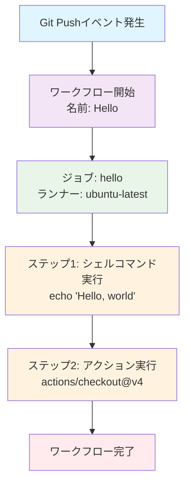

# my-repo
GitHub Actionsの練習用

## hello.yml ワークフローについて

`hello.yml`は、GitHub Actionsを使用したシンプルなワークフローファイルです。リポジトリにプッシュが行われた際に自動実行されます。

### 処理の流れ

### 詳細説明

1. **トリガー**: `on: push` により、リポジトリへのプッシュ時にワークフローが起動
2. **実行環境**: Ubuntu最新版のランナーで実行
3. **実行ステップ**:
   - `echo "Hello, world"`: コンソールに挨拶メッセージを出力
   - `actions/checkout@v4`: リポジトリのソースコードをチェックアウト

このワークフローは、GitHub Actionsの基本的な動作を学習するためのサンプルです。